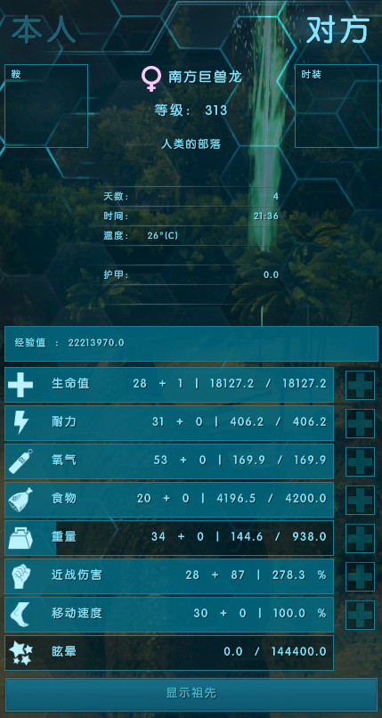

# ark-status-point

A lightweight ARK: Survival Evolved mod.

source: https://github.com/star-hengxing/ark-status-point

- 

Support version:
- 358.25

# Features

- [x] Person status point.
- [x] Dino status point.

# Usage

Copy `ark-status-point.dll` & `dwmapi.dll` to ShooterGame.exe directory.

# Build

- [xmake](https://xmake.io/#/guide/installation)
- C++20 compiler.

## Setup

- [Visual Studio](https://visualstudio.microsoft.com) (If you just want to build without developing, download the [Microsoft C++ Build Tools](https://visualstudio.microsoft.com/visual-cpp-build-tools))

- Recommend use [scoop](https://scoop.sh) as package manager on Windows.

```sh
scoop install xmake
```

Clone repo
```sh
xmake -y
```

## Test

```sh
xmake f --ark_dir=<ShooterGame.exe directory>
xmake run
```

# Credits

- [Detours](https://github.com/microsoft/Detours)
- [fmt](https://github.com/fmtlib/fmt)
